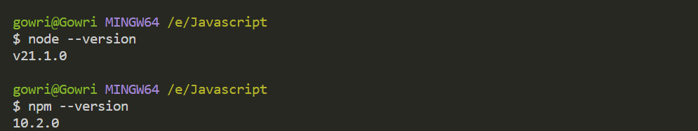
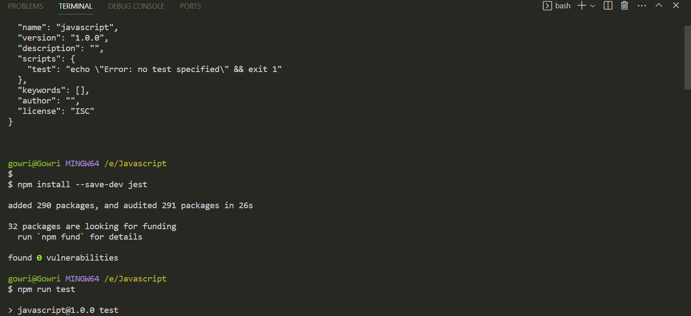
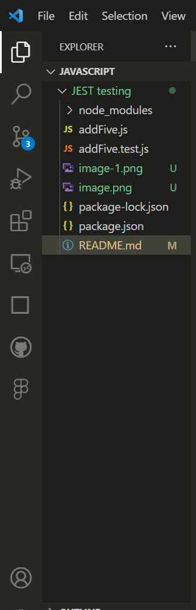

# JEST testing
<h2>TESTING </h2>
<ol>
 <li>Why Developers test their Code</li>
  <li>RED-GREEN-REFACTOR cycle</li>
   <li>Manual and Automated Testing</li>
    <li>Unit testing</li>
</ol>
<h3> JavaScript Environments </h3>

Node.js can run in multiple settings. For example, on the command line, in a desktop application, or on the back end of a web app. Before the introduction of Node.js, developers had to build backends in other technologies and languages such as PHP, Python, C-sharp, Ruby, and Java. After Node.js became available, it was possible to use JavaScript on the backend or on the server-side. This means that today you can write full-stack JavaScript programs. In other words, you can write JavaScript on the client and on the server. Node.js comes with a package manager called npm, which stands for Node Package Manager. The package manager allows you to use a large number of libraries and frameworks as Node.js modules. An npm module is a standalone piece of code that has been published on the npm website. Sometimes an npm module is also referred to as an npm package. 

<h3> JEST Intro </h3>

JavaScript that has no built-in testing functionality? For JavaScript, you can use testing frameworks like Jest.Therefore, many different libraries have been built to tackle the issue of testing. Some examples of these libraries include Jasmine, Mocha, Karma, and qUnit. Then there is the one that you will cover now, namely the Jest testing framework. Jest is a JavaScript testing framework. It's often used for testing code like React, a JavaScript library maintained by Meta and a community of individual developers and companies. Besides plain JavaScript and React code just allows you to test Babel, TypeScript, Node, Angular, Vue, and various other frameworks. Jest also supports code coverage. Code coverage is a measure of what percentage of my code is covered by tests. If I say that I have an 80 percent code coverage, that means that only one-fifth of my entire code base is not covered by tests. But even 100 percent code coverage doesn't mean that you have tested for every conceivable expectation. It just means that there are some expectations tested for each line of my code. Still, code coverage is a handy tool to gauge the amount of my code base that's included in tests. The higher the code coverage, the lower the chance of having unidentified bugs. As a rule, the higher the percentage of code coverage, the lower the amount of time required to write new tests. This, however, depends on whether there are incomplete software requirements pending or if you are going to receive more requirements in the future. Next, let's cover the concept of mocking. Mocking allows you to separate the code that you are testing from it's related dependencies. In other words, you can use the mocking features to make sure that your unit testing is stand-alone. For example, you can test the front end functionality of your web app by mocking the data as if it came back from a server when in fact it came from the client. Mocking is especially helpful because very often web applications are built by teams of developers. Some developers work on the backend of a feature and others work on the front end. This could result in bottlenecks.

<h6> 👉Test as Expectations</h6>

 Code Syntax that specifies the Expected result as passing Specifiv values to your Functions 

You can test your implementations with various inputs and the tests become a specific kind of documentation for the new members of your team. 

